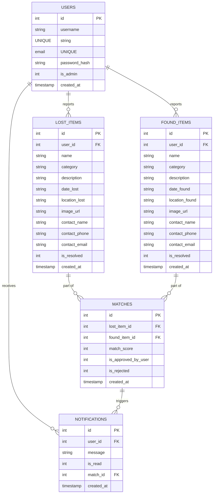

# FindBack - Lost & Found Web Application

FindBack is a modern, responsive, full-stack Lost & Found web application designed to connect users who have lost belongings with those who have found them. It features user authentication, reporting dashboards, real-time match suggestions, notifications, and an administrative control panel. 

The application utilizes **Flask** for the backend, **SQLite** as the database, **Bootstrap 5** for responsive layout, and vanilla **CSS3** and **JavaScript** for sleek interactivity and animations.

---

## Features

1. **User Authentication**: Secure user registration and login with encrypted passwords (via `werkzeug.security`). Custom user profiles allow updating emails and passwords.
2. **Lost Item Reporting**: Users can report lost items by uploading an image, detailing the category, name, location, date, description, and contact info.
3. **Found Item Reporting**: Users can report found items similarly, specifying where and when they were recovered.
4. **Smart Match Engine**: Automatically computes match likelihood scores between new reports and existing reports based on:
   - Category similarity (mandatory requirement)
   - Location proximity (string tokens intersection)
   - Keyword overlaps (title and description text tokenizer)
   - Date closeness (ideal distance scoring)
5. **Real-time Notifications**: Alert system that informs users immediately when a potential match is found.
6. **Smart Search & Filters**: Search database listings by keyword, location, type (lost vs. found), and category.
7. **Interactive Dashboard**: Quick metrics on total items reported, active reports, matches resolved, and recent items.
8. **Admin Panel**: Statistics view, user moderation, report review, and fake report deletion.
9. **UI/UX Customization**: Fully responsive glassmorphism aesthetic with seamless light and dark mode toggles.

---

## Folder Structure

```text
lost-and-found/
├── app.py                  # Main Flask application & routes
├── models.py               # SQLite database CRUD operations & connections
├── matching.py             # Match scoring logic & notification generation
├── schema.sql              # Database structure
├── setup_sample_data.py    # Database initial seeder script
├── requirements.txt        # Backend dependencies
├── static/
│   ├── css/
│   │   └── style.css       # Custom CSS styling (Light/Dark themes, Glassmorphism, animations)
│   ├── js/
│   │   └── main.js        # DOM management, theme toggle, dynamic previews, async notifications
│   └── uploads/            # User-uploaded images folder (git-ignored)
└── templates/
    ├── base.html           # Base layout containing header/navbar/footer/CDNs
    ├── index.html          # Main landing dashboard
    ├── login.html          # Login screen
    ├── register.html       # Register screen
    ├── profile.html        # User Profile & reported items portal
    ├── report_lost.html    # Submit Lost Item form
    ├── report_found.html   # Submit Found Item form
    ├── items.html          # Search & Filters listing
    ├── item_detail.html    # Detail view of a report and suggested matches
    ├── notifications.html  # User notification mailbox
    └── admin.html          # Administrative console
```

---

## Database Schema



---

## Setup & Running Instructions

The project can be run using the standard Python toolchain or the high-performance package manager `uv`.

### Method 1: Using `uv` (Recommended / Installed)

If `uv` is installed, execute the following commands in the workspace root folder:

1. **Seed and Initialize Database**:
   ```bash
   uv run --with Flask --with Werkzeug --python 3.11 python setup_sample_data.py
   ```

2. **Run Web App**:
   ```bash
   uv run --with Flask --with Werkzeug --python 3.11 python app.py
   ```

### Method 2: Standard Python & Virtual Environment

If using regular Python:

1. **Create Virtual Environment**:
   ```bash
   python -m venv venv
   source venv/bin/activate       # On Linux/macOS
   venv\Scripts\activate          # On Windows
   ```

2. **Install Dependencies**:
   ```bash
   pip install -r requirements.txt
   ```

3. **Initialize & Seed Database**:
   ```bash
   python setup_sample_data.py
   ```

4. **Run Web App**:
   ```bash
   python app.py
   ```

Open `http://127.0.0.1:5000` in your browser.

---

## Testing Credentials

The database seeder pre-populates three test accounts:

1. **Admin User**:
   - **Username**: `admin`
   - **Password**: `admin123`
2. **Standard User 1**:
   - **Username**: `alice`
   - **Password**: `alice123`
3. **Standard User 2**:
   - **Username**: `bob`
   - **Password**: `bob123`
